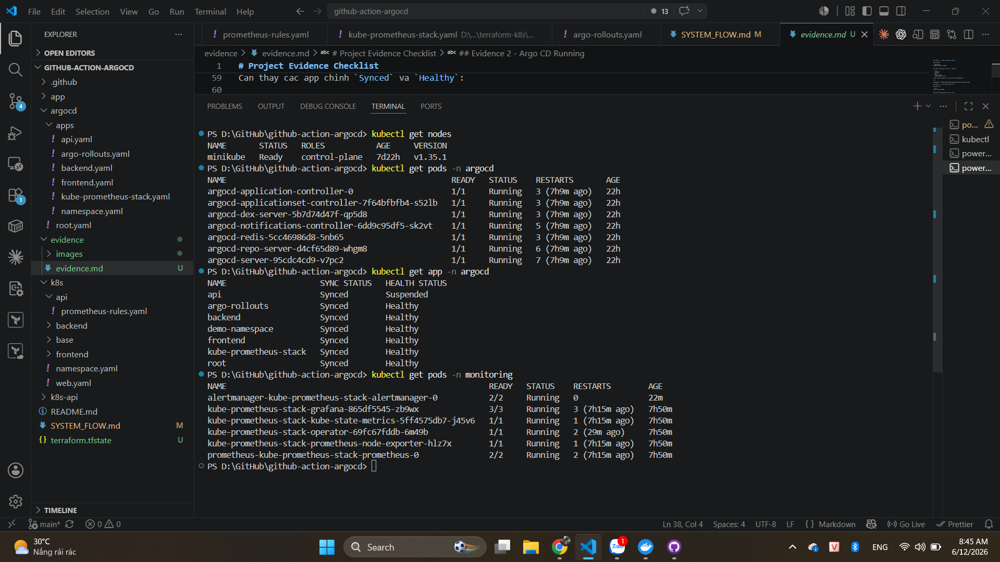
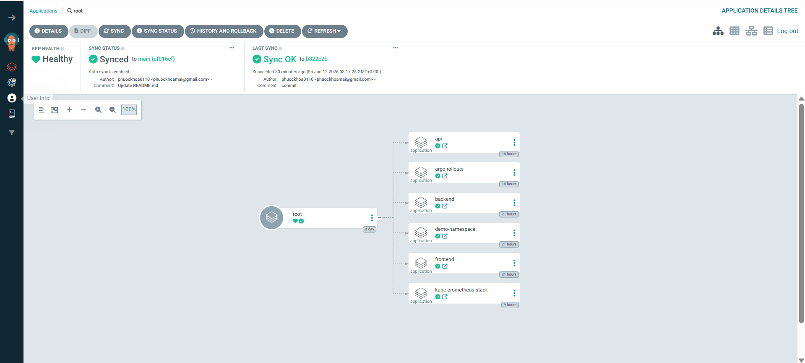
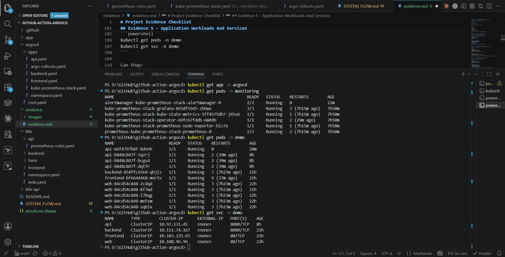
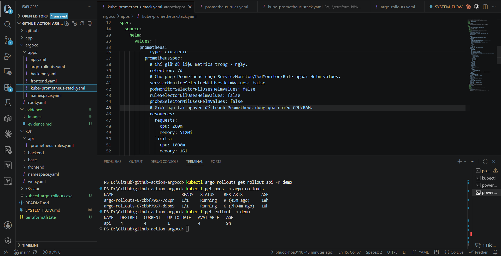
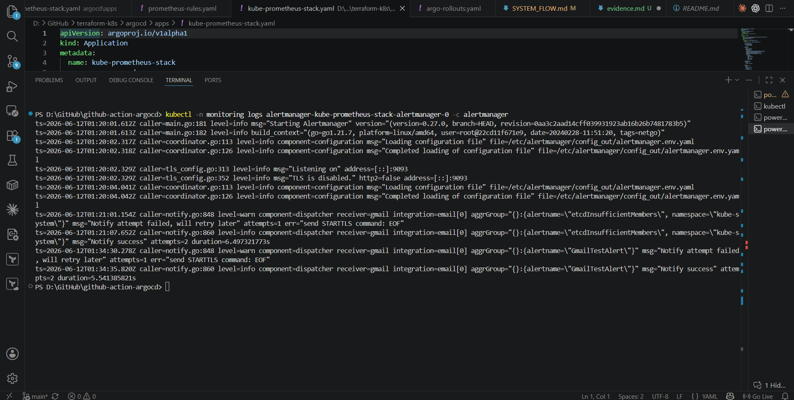

# Project Evidence

Tài liệu này giải thích các hình evidence hiện có trong thư mục `evidence/images`.
Các hình này chứng minh luồng chính của dự án:

```text
GitHub repo
  -> Argo CD GitOps App-of-Apps
  -> Kubernetes workloads/services
  -> Argo Rollouts canary
  -> Prometheus + Alertmanager
  -> Gmail alert
```

## Evidence 1 - Tổng Quan Hệ Thống



Hình này chứng minh các thành phần nền tảng của hệ thống đều đã chạy.

Các lệnh xuất hiện trong hình:

```powershell
kubectl get nodes
kubectl get pods -n argocd
kubectl get app -n argocd
kubectl get pods -n monitoring
```

Phần `kubectl get nodes` cho thấy node `minikube` ở trạng thái `Ready`. Điều này chứng minh Kubernetes cluster đang hoạt động.

Phần `kubectl get pods -n argocd` cho thấy các pod Argo CD đang `Running`, gồm các thành phần quan trọng như:

- `argocd-application-controller`
- `argocd-repo-server`
- `argocd-server`
- `argocd-redis`

Các pod này giúp Argo CD đọc manifest từ Git và đồng bộ tài nguyên vào Kubernetes.

Phần `kubectl get app -n argocd` cho thấy các application chính đang được Argo CD quản lý:

- `root`
- `api`
- `argo-rollouts`
- `backend`
- `demo-namespace`
- `frontend`
- `kube-prometheus-stack`

Các app này đang `Synced` và `Healthy`, nghĩa là trạng thái trong cluster đang khớp với manifest trong Git.

Phần `kubectl get pods -n monitoring` cho thấy monitoring stack đang chạy:

- Alertmanager
- Grafana
- kube-state-metrics
- Prometheus Operator
- node-exporter
- Prometheus

Luồng được chứng minh:

```text
Minikube Ready
  -> Argo CD Running
  -> Argo CD Applications Synced/Healthy
  -> Monitoring Stack Running
```

## Evidence 2 - Argo CD App-of-Apps Tree



Hình này chụp giao diện Argo CD của application `root`.

Trong hình, `root` là application cha. Từ `root`, Argo CD quản lý các application con:

```text
root
|-- api
|-- argo-rollouts
|-- backend
|-- demo-namespace
|-- frontend
`-- kube-prometheus-stack
```

Ý nghĩa từng application:

| Application | Vai trò |
| --- | --- |
| `api` | Deploy API Flask bằng Argo Rollouts, ServiceMonitor và PrometheusRule |
| `argo-rollouts` | Cài controller Argo Rollouts |
| `backend` | Deploy backend service |
| `demo-namespace` | Tạo namespace `demo` |
| `frontend` | Deploy frontend service |
| `kube-prometheus-stack` | Cài Prometheus, Grafana, Alertmanager |

Trên UI, `root` đang `Healthy` và `Synced`. Điều này chứng minh mô hình GitOps App-of-Apps:

```text
argocd/root.yaml
  -> argocd/apps/*
  -> child Applications
  -> Kubernetes resources
```

## Evidence 3 - Workloads Và Services



Hình này chứng minh workload thật đã được deploy vào Kubernetes.

Các lệnh xuất hiện trong hình:

```powershell
kubectl get pods -n monitoring
kubectl get pods -n demo
kubectl get svc -n demo
```

Phần `kubectl get pods -n monitoring` cho thấy monitoring stack vẫn đang `Running`, bao gồm Alertmanager, Grafana và Prometheus.

Phần `kubectl get pods -n demo` cho thấy các pod của ứng dụng đang chạy:

- Nhiều pod `api` đang `Running`
- Pod `backend` đang `Running`
- Pod `frontend` đang `Running`
- Các pod `web` demo cũng đang `Running`

Phần `kubectl get svc -n demo` cho thấy các service nội bộ:

| Service | Vai trò |
| --- | --- |
| `api` | Expose API Flask trên port `8080` |
| `backend` | Expose backend service trên port `8080` |
| `frontend` | Expose frontend trên port `80` |
| `web` | Service demo độc lập trên port `80` |

Ý nghĩa của hình này:

- Manifest trong Git đã được Argo CD sync thành pod/service thật.
- Namespace `demo` có đầy đủ frontend, backend và API.
- API có nhiều replica, phù hợp cho rollout/canary.
- Service tồn tại để các workload có endpoint ổn định trong cluster.

Luồng workload:

```text
Argo CD sync manifest
  -> Kubernetes tạo pod
  -> Kubernetes tạo service
  -> frontend/backend/api chạy trong namespace demo
```

Luồng metrics:

```text
API pod expose /metrics
  -> Service api
  -> ServiceMonitor api
  -> Prometheus scrape metrics
```

## Evidence 4 - Argo Rollouts Canary



Hình này chứng minh API được triển khai bằng Argo Rollouts.

Các lệnh xuất hiện trong hình:

```powershell
kubectl argo rollouts get rollout api -n demo
kubectl get pods -n argo-rollouts
kubectl get rollout -n demo
```

Phần `kubectl get pods -n argo-rollouts` cho thấy controller Argo Rollouts đang `Running`.

Phần `kubectl get rollout -n demo` cho thấy rollout `api` tồn tại với các cột:

- `DESIRED`
- `CURRENT`
- `UP-TO-DATE`
- `AVAILABLE`

Điều này chứng minh API không chỉ chạy bằng Deployment thường, mà được quản lý bằng resource `Rollout`.

Luồng canary:

```text
Git thay đổi API
  -> Argo CD sync Rollout
  -> Argo Rollouts tạo version mới
  -> Canary chạy từng bước
  -> Prometheus kiểm tra metric
  -> Nếu ổn thì rollout tiếp
  -> Nếu lỗi cao thì abort
```

Ý nghĩa:

- Dự án có Argo Rollouts controller.
- API có resource `Rollout`.
- Hệ thống hỗ trợ triển khai canary.
- Có thể kết hợp Prometheus metric để kiểm tra rollout.

## Evidence 5 - Alertmanager Gửi Gmail Thành Công



Hình này chứng minh luồng cảnh báo đã gửi mail thành công.

Lệnh xuất hiện trong hình:

```powershell
kubectl -n monitoring logs alertmanager-kube-prometheus-stack-alertmanager-0 -c alertmanager
```

Trong log có các dòng quan trọng:

```text
receiver=gmail
GmailTestAlert
Notify success
```

Ý nghĩa:

- `GmailTestAlert` là alert test được Prometheus gửi sang Alertmanager.
- `receiver=gmail` nghĩa là Alertmanager route alert về receiver Gmail.
- `Notify success` nghĩa là Alertmanager gửi email thành công.

Luồng cảnh báo:

```text
PrometheusRule
  -> Prometheus đánh giá PromQL
  -> Alert firing
  -> Alertmanager nhận alert
  -> Receiver gmail
  -> SMTP Gmail
  -> Email về Gmail
```

Điểm quan trọng:

- Gmail app password không được commit vào Git.
- Alertmanager đọc password từ Secret `alertmanager-gmail-auth`.
- Secret nằm trong namespace `monitoring`.

## Tổng Kết Evidence

| Evidence | File ảnh | Chứng minh |
| --- | --- | --- |
| 1 | `images/01-system-overview.png` | Cluster, Argo CD apps và monitoring stack đang chạy |
| 2 | `images/02-argocd-app-tree.png` | Mô hình GitOps App-of-Apps |
| 3 | `images/03-workloads-services.png` | Pod và Service thật của ứng dụng trong namespace `demo` |
| 4 | `images/04-canary-rollout.png` | API triển khai bằng Argo Rollouts canary |
| 5 | `images/05-gmail-alert.png` | Alertmanager gửi Gmail thành công |

Luồng tổng thể được chứng minh bởi bộ evidence:

```text
GitHub repo
  -> Argo CD root application
  -> Argo CD child applications
  -> Kubernetes namespaces
  -> frontend/backend/api workloads
  -> Argo Rollouts canary cho API
  -> Prometheus scrape metrics
  -> Alertmanager gửi Gmail
```

Nếu mentor hỏi thêm về CI/CD validation, có thể bổ sung ảnh file:

```text
.github/workflows/validate.yml
```

Giải thích ngắn:

```text
Pull Request
  -> GitHub Actions chạy kubeconform
  -> Validate Kubernetes YAML
  -> Không deploy trực tiếp
  -> Argo CD mới là thành phần sync cluster từ Git
```
